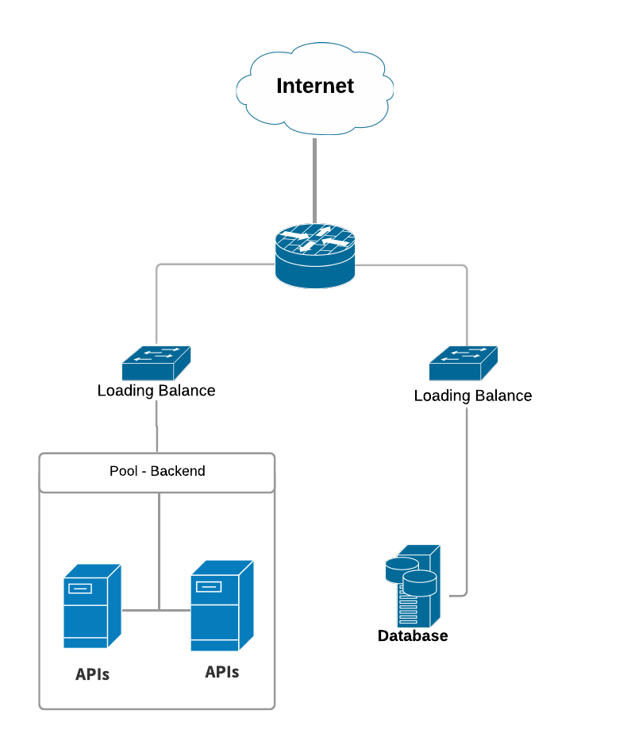

# APIs de blog em PHP usando MongoDB

> Esse projeto tem como finalidade as seguintes ações:

1. Exibir uma lista de posts, autores e seus comentários.
2. Exibir um único post sendo identificado pelo seu ID, autor e os comentários do post.
3. Criar um novo post

## Pré-requisitos

* [Composer](https://getcomposer.org/download/)
* [Docker](https://docs.docker.com/)

## Instalação e Configuração

### Clonando o projeto

```bash
$ git clone https://github.com/dejaneves/api-blog-php.git
```

### Instalando as Dependêcias

Após baixar o projeto entre na pasta `api-blog-php`.

```bash
$ cd api-blog-php
```
e execute o sequinte comando, para instalar as dependências.

```bash
$ composer install
```

### Executando o Projeto

```bash
$ docker-compose up -d
```

**Importante**
Se o docker da sua máquina estiver para o usuário *root* não esqueça de acrescentar o comando *sudo* : 

Exemplo:

`sudo docker-compose up -d`

OBS.: a opção `-d` é para aplicação rodar em background.

## Rotas *(end-points)*

Todas as rotas criadas para o projeto se encontram no diretório `routes/api.php`.

### Exibir todos os posts.

```http
GET:

http://localhost:8000/api/v1/posts
```

### Exibir um post passando como paramentro seu {ID}.
```http
GET:

http://localhost:8000/api/v1/posts/:id
```

### Criar um novo post.

```http
POST:

http://localhost:8000/api/v1/posts
```

#### Exemplo:

Cria um novo post passando um autor que já existe no banco de dados.

```javascript

{
  "title": "Lorem ipsum dolor sit amet.",
  "body": "Quisque at tristique sem. Vestibulum a pellentesque metus.",
  
  // ID do autor cadastrado no seu banco de dados
  "author_id" : 10
}
```

Cria um novo post, mas adicionando um novo autor.

```javascript

{
  "title": "Lorem ipsum dolor sit amet.",
  "body": "Quisque at tristique sem. Vestibulum a pellentesque metus.",

  // Dados do novo autor
  "author_name":"Jaime Neves",
  "author_username":"jaimeneves",
  "author_email":"jaime@gmail.com",
  "author_phone":"92 981255658",
  "author_website":"jaimeneves.com.br"
}
```

Na hora de inserir um novo post o método checa se existe uma *key* chamada **author_id** se ela for encontrada no corpo da requisição, o método não checa os outros dados do autor e pega o valor dessa *key* como sendo o próprio autor do post.

## Infra



### APIs e Loading Balance

Teremos um **Loading Balance** recebendo requisições HTTP e distribuindo as requisições via **NGINX** para um pool escalável de máquinas, onde estarão nossas APIs rodando como microservices.

Nossa API pode ser colocada em produção, rodando em 2 máquinas ou mais, como mostrado na figura acima. Quando nosso Loading Balance receber as requisições ele pode buscar em 2 endereços (máquinas), para melhorar a latência e balancear a carga.

Nosso trigger para autoscaling será utilização de CPU, que através de ferramentas podemos obter diversas informações dos recursos que estão sendo utilizados, e com isso tomar alguma ação, como por exemplo: Criar  alarmes que serão ativados quando a utilização de CPU chegar em determinado percentual.

### Banco de dados

Nossas APIs se comportando como microservices, então cada uma terá que ter seu prórpio banco de dados.

Nosso banco de dados também pode ser colocado em uma máquina separada, e fazer sua propria réplica caso seja necessário.

## Boas Práticas de Desenvolvimento

O projeto usa o padrão de arquitetura MVC.

Para todos os Endpoints da API decidir usar o prefix `/api/v1` para fazer seu versionamento.

Por exemplo:

Todos os controllers que pertencem a versão `v1` da API ficam no diretório `App/Http/Controllers/Api/V1`.

Se for preciso criar uma outra versão da API sem depreciar em primeiro momento a `v1`, podemos criar todos os controllers em `App/Http/Controllers/Api/V2` para uma versão `v2`, e assim sucessivamente pra outras versões.

### Idioma

O idioma escolhido para o projeto, foi o inglês, pra seguirmos os mesmo padrão de respostas do JSON Place Holder.


| Item  | valor |
| ------------- | ------------- |
| MongoDB  | Collections e nomes de seus fields  |
| Codificação  | Classes métodos, atributos e variáveis  |
| Git  | Mensagens de commits  |

### Codificação

| Item  | valor |
| ------------- | ------------- |
| Indentação  | Tamanho 2  |
| Comprimento Linha  | 100 caracteres  |
| Número Linha de Arquivo  | 500 linhas  |

Pequenos comentários para identificar o objetivo de uma classe, método ou variável.

## Tecnologias e Ferramanetas Usadas

* MongoDB
* PHP 7.2.16
* Laravel Framework
* Composer
* [Status Codes, Errors e Mensagens](https://github.com/dingo/api)
* [Driver para MongoDB](https://github.com/jenssegers/laravel-mongodb)
